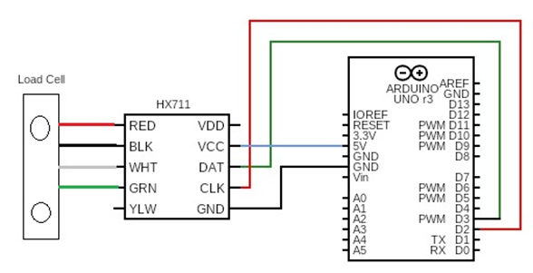
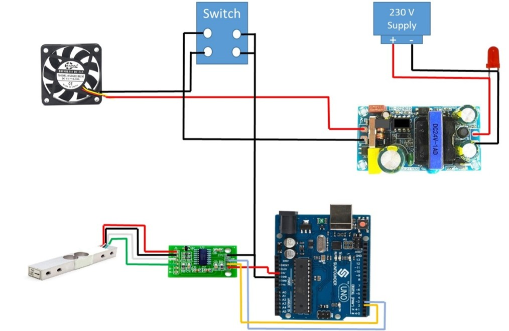
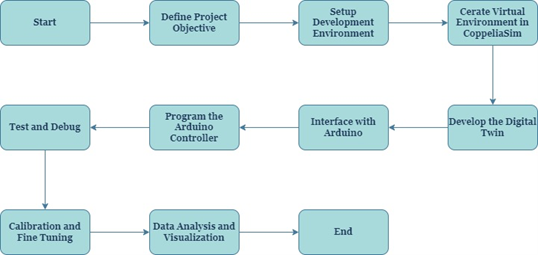
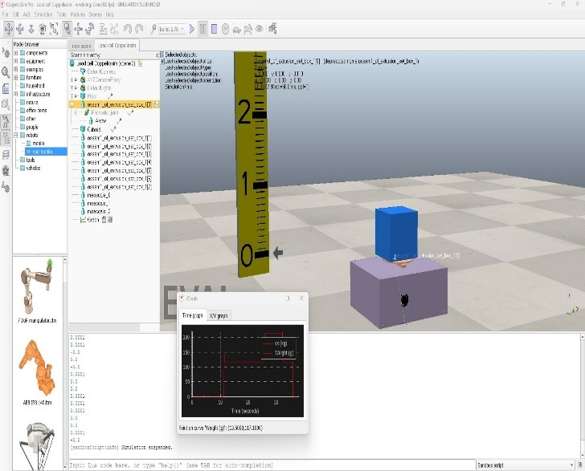
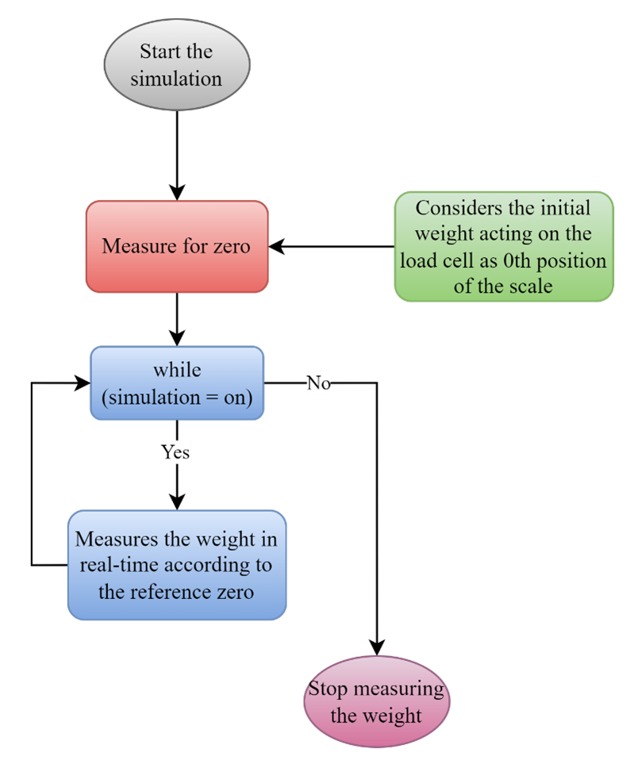
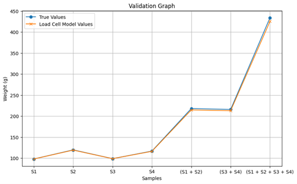
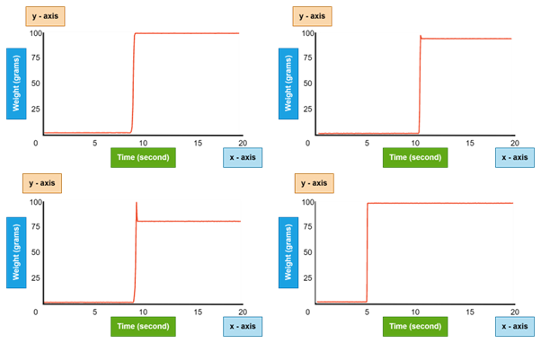

# ⚖️ Real-Time Load Cell Integration with CoppeliaSim and Arduino

> *Robotics Simulation · Sensor Integration · Digital Twin · Real-Time Systems*

---

## 🔬 Research Overview

This repository presents the implementation and validation framework for the research work:

**“Characterization and Integration of Electronic Weight Measuring Devices Using Real-Time Dynamic Simulation Environment”**
Published in *Journal of the Brazilian Society of Mechanical Sciences and Engineering (Springer)*.

The project focuses on the **design, characterization, and real-time integration of a physical load cell** with a **dynamic robotics simulation environment (CoppeliaSim)** using **Arduino**. The work demonstrates how real-world sensor behavior can be faithfully mirrored inside a simulator through a **digital twin approach**, enabling accurate validation before deployment in robotic systems.

🔗 **Published Paper:** [https://link.springer.com/article/10.1007/s40031-024-01095-y](https://link.springer.com/article/10.1007/s40031-024-01095-y)

---

## 🎯 Research Contributions

* Designed a **hardware–software co-simulation framework** for load cell validation
* Integrated a **physical load cell with CoppeliaSim** using real-time serial communication
* Developed a **digital twin of the load cell** for dynamic simulation and analysis
* Achieved **99.514% accuracy for individual loads** and **98.023% accuracy for cumulative loads**
* Demonstrated robustness of simulation-based sensor validation for robotics applications

This work is particularly relevant for **robotic manipulation, weight-based sorting, force-aware grasping, and simulation-driven sensor design**.

---

## 📂 Repository Structure

```
├── codes/
│   ├── arduino/                # Arduino-based load cell interface (provided separately)
│   └── coppeliasim/            # CoppeliaSim scene & scripts (provided separately)
│
├── figures/
│   ├── methodology_fig5.png    # Figure 5 – Hardware schematic architecture
│   ├── methodology_fig6.png    # Figure 6 – Hardware wiring diagram
│   ├── methodology_fig7.png    # Figure 7 – Software integration workflow
│   ├── methodology_fig10.png   # Figure 10 – CoppeliaSim child script environment
│   ├── methodology_fig12.png   # Figure 12 – Load cell digital twin in operation
│   ├── result_fig14.png        # Figure 14 – Weight measurement in CoppeliaSim
│   └── result_fig16.png        # Figure 16 – Weight comparison graph
│
└── README.md
```


---

## 🧠 System Methodology

The proposed system integrates **hardware sensing**, **real-time data acquisition**, and **dynamic simulation** into a unified validation pipeline.

### 📐 Methodology Figures

#### Hardware Architecture & Integration


*Figure 1: Schematic circuit diagram of the load cell hardware architecture.*


*Figure 2: Wiring diagram illustrating load cell, HX711, and Arduino connections.*

---

#### Software & Digital Twin Workflow


*Figure 3: Software integration workflow showing interaction between Arduino, serial communication, and CoppeliaSim digital twin.*


*Figure 4: CoppeliaSim platform with embedded child script managing real-time sensor input.*


*Figure 5: Operational digital twin of the load cell synchronized with physical hardware.*

---

## 🧪 Experimental Results & Validation

The load cell model was evaluated using **multiple objects of varying shapes and masses**, both individually and cumulatively, and compared against a **high-precision Wensar balance**.

### 📊 Result Visualizations


*Figure 6: Weight measurement of different objects obtained through CoppeliaSim simulation.*


*Figure 7: Comparative graph showing weight measurements across physical experiments and simulation outputs.*

---

## 📈 Key Results

* **Individual load accuracy:** 99.514%
* **Cumulative load accuracy:** 98.023%
* Minor deviations observed under stacked loads due to:

  * Load cell non-linearity at higher ranges
  * Friction and hysteresis effects
  * Off-axis force introduction

The results confirm that **digital twin–based simulation is a reliable and efficient approach** for validating real-world sensors prior to deployment.

---

## 🚀 Research Significance & Applications

This project demonstrates a **scalable methodology for sensor–simulation integration**, making it highly relevant for:

* Robotics and automation research
* Digital twin development
* Simulation-based testing of sensors
* Robotic arms and weight-based sorting systems
* Industry 4.0 and cyber–physical systems

---

## 📜 Citation

If you use or reference this work, please cite:

> Nandakumar R., et al.
> *Characterization and Integration of Electronic Weight Measuring Devices Using Real-Time Dynamic Simulation Environment.*
> **Journal of the Brazilian Society of Mechanical Sciences and Engineering**, 2024.
> [https://link.springer.com/article/10.1007/s40031-024-01095-y](https://link.springer.com/article/10.1007/s40031-024-01095-y)

---

## 👨‍🔬 Author

**Nandakumar R**
B.Tech – Robotics & Automation
Research Interests: Robotics Simulation, Digital Twins, Sensors, Real-Time Systems

---

## 🤝 Collaboration

This repository is intended for **academic, research, and portfolio use**. Researchers interested in extending this work toward advanced robotics sensing or simulation frameworks are encouraged to connect.
